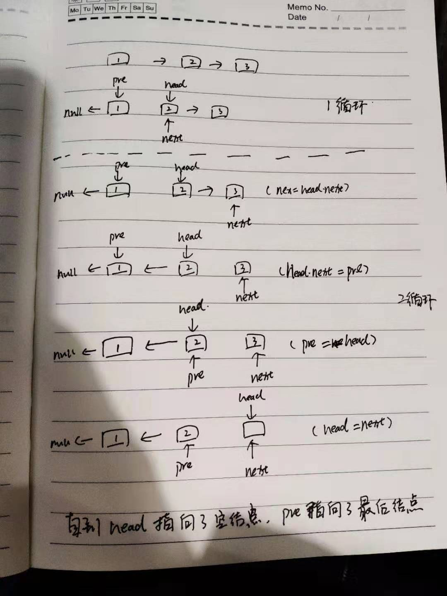

### 链表反转

实现链表反转需要三个节点指针（current,pre,next）分别指向当前节点，当前节点的上一个节点和当前节点的下一个节点
  
- 保存当前节点的下一个节点，避免节点丢失
- 把当前节点的next指向上一个节点，实现反转
- 把上一个节点指针指向当前节点
- 把当前节点指针指向下一个节点
- 以此类推，当当前节点指针指向null的时候，表示已经遍历完所有节点，pre即是反转后链表的头节点

```java
class Node{
    Node next;
    int data;
    Node(int data){
        this.data = data;
    }
}

public Node reverseNode(Node head){
    Node current =head;
    Node next=null;
    Node pre = null;
    while(current!=null){
        next = current.next;
        current.next = pre;
        pre = current;
        current = next;
    }
    return pre;
}

```

单链表的反转代码没多少，但是第一次看的话也是一脸懵，主要是被指针指来指去绕晕了。这时，最好的办法就是画图，画出每一次循环后，链表的变动，多练几次就有感觉了
