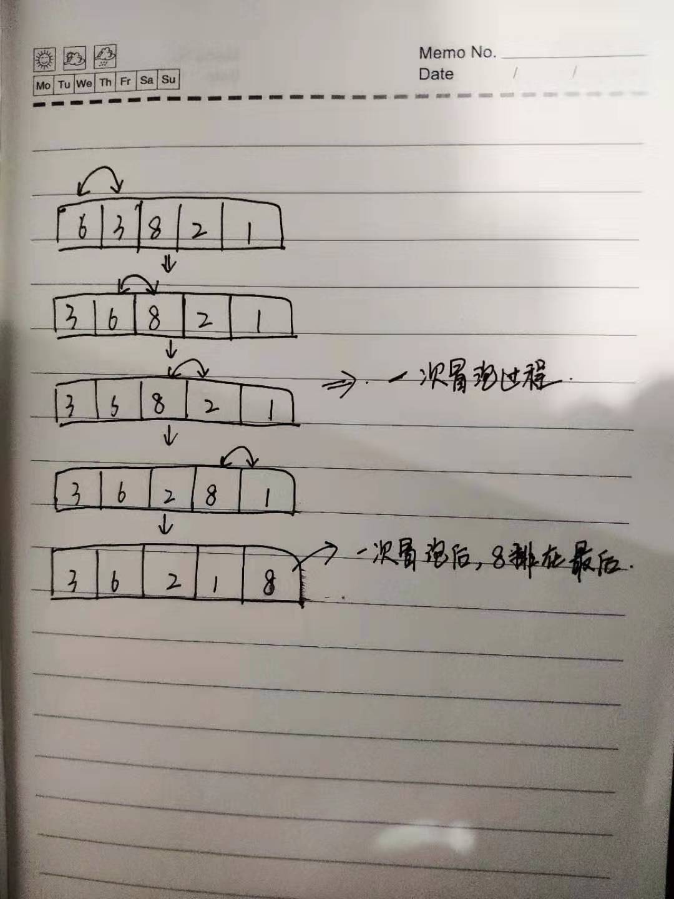

### 排序算法的几个评价条件
1. 原地排序：如果排序算法的空间复杂度为O(1)，则称为稳定排序
2. 稳定排序：对于相同元素，如果排序前后他们位置关系不变，则称为稳定排序
3. 执行效率（时间、空间复杂度）


#### 思路
每次只比较`相邻2个数据`，并交换位置，一次遍历后，至少有一个数据被移动到它应该的位置上（如果没有，说明已经按照顺序排列），一次遍历过程成为一次冒泡，经过n次冒泡后就可以完成对数据排序了。可以看下面这张图加深理解

冒泡过程还可以优化，如果某次的冒泡没有任何移动，表示已经数据已经排序完成，直接退出循环

#### 代码
```java

int[] bubbleSort(int[] data){
    int length = data.length;
    //length次maopao冒泡
    for(int i=0;i<length;i++){
        boolean isContinue;
        //一次冒泡
        for(int j=0;j<length-1;j++){
            if(data[j]>data[j+1]){
                //数据交换
                int temp = data[j];
                data[j] = data[j+1];
                data[j+1] =temp;
                isContinue =true;
            }
        }
        //没有数据交换，退出循环
        if(!isContinue){
            break;
        }
    }

    return data;
        
}

```

#### 分析
- 因为只用了几个临时变量的空间，空间复杂度为O(1)，所以冒泡排序是原地排序
- 在比较的过程中，对于相同的元素，不做位置交换。所以，排序前后相同元素的位前后关系不变。冒泡是稳定排序
- 时间复杂度为O(n)