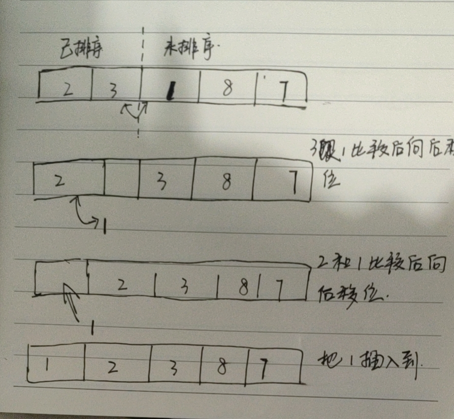

#### 思路

把数据分为已排序和未排序两部分，从未排序数据中取出取出第一位依次跟已排序的数据比较，找到响应的位置插入。初始时，已排序部分就是第0位数据，具体过程可以看👇的图



#### 代码实现
```java
int[] insertSort(int[] data){
    //位排序部分
    for(int i=1;i<data.length;i++){
        int j = i-1;
        //待比较的数据
        int temp = data[i];
        //未排序部分
        for(;j>=0;j--){
            if(temp<data[j]){
                //向后移动一位
                data[j+1] = data[j];
            }
        }

        //插入数据
        data[j+1] = temp;
    }
    return data;
}
```