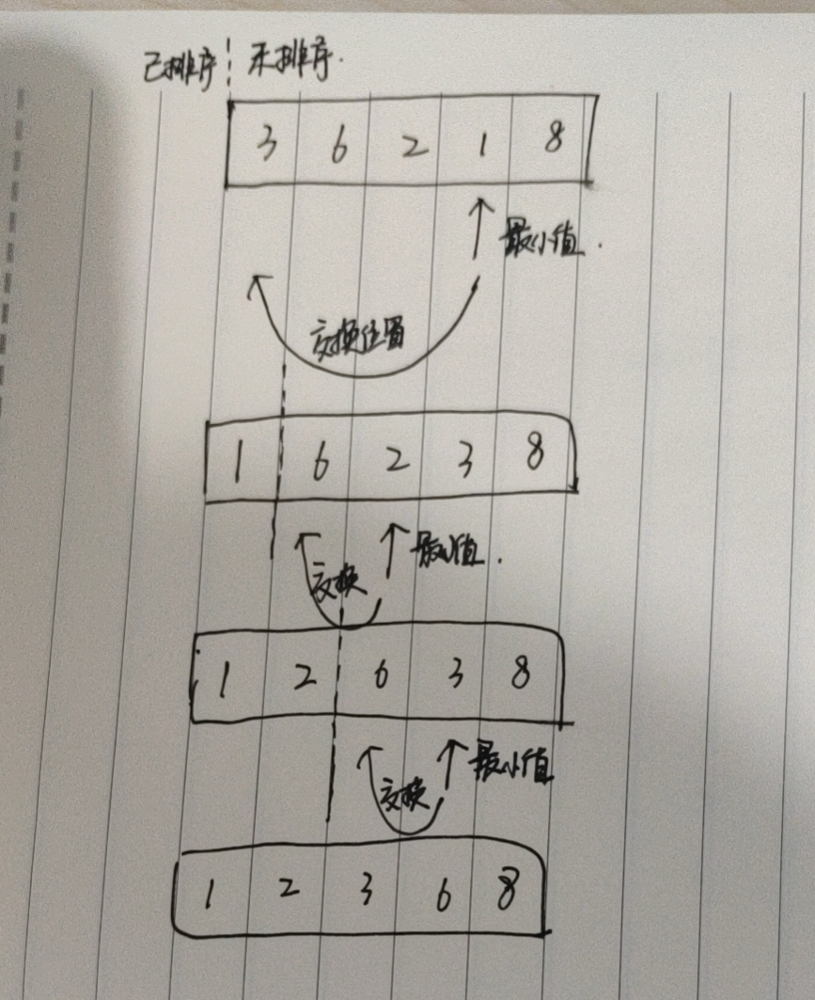

#### 思路
跟插入排序一样，把数据分为已排序和未排序两部分。然后在未排序数据中找到最小值（或者最大值），再放到已排序数据的末尾。如下图



#### 代码实现
```java
int[] choiseSort(int[] data){
    for(int i=0;i<data.length;i++){
        int minIndex = i;

        for(int j=i+1;j<data.length;j++){
            if(data[j]<data[minIndex]){
                minIndex = j;
            }
        }

        //交换位置
        int temp = data[i];
        data[i] = data[minIndex];
        data[minIndex] = temp;
    }
    
    return data;
}

```

#### 分析
- 因为只用了几个临时变量的空间，空间复杂度为O(1)，所以选择排序是原地排序
- 每次都选择一个最小值放在未排序的数据的后面，相同数据的前后关系变了，所以选择排序是`不稳定的排序`
- 时间复杂度为O(n^2)